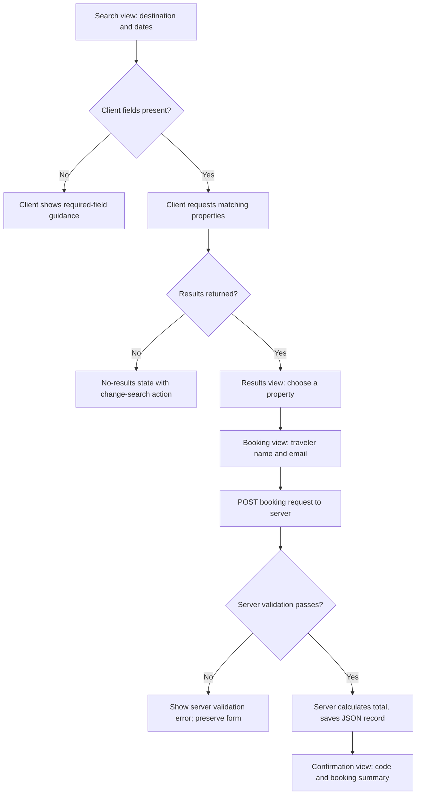
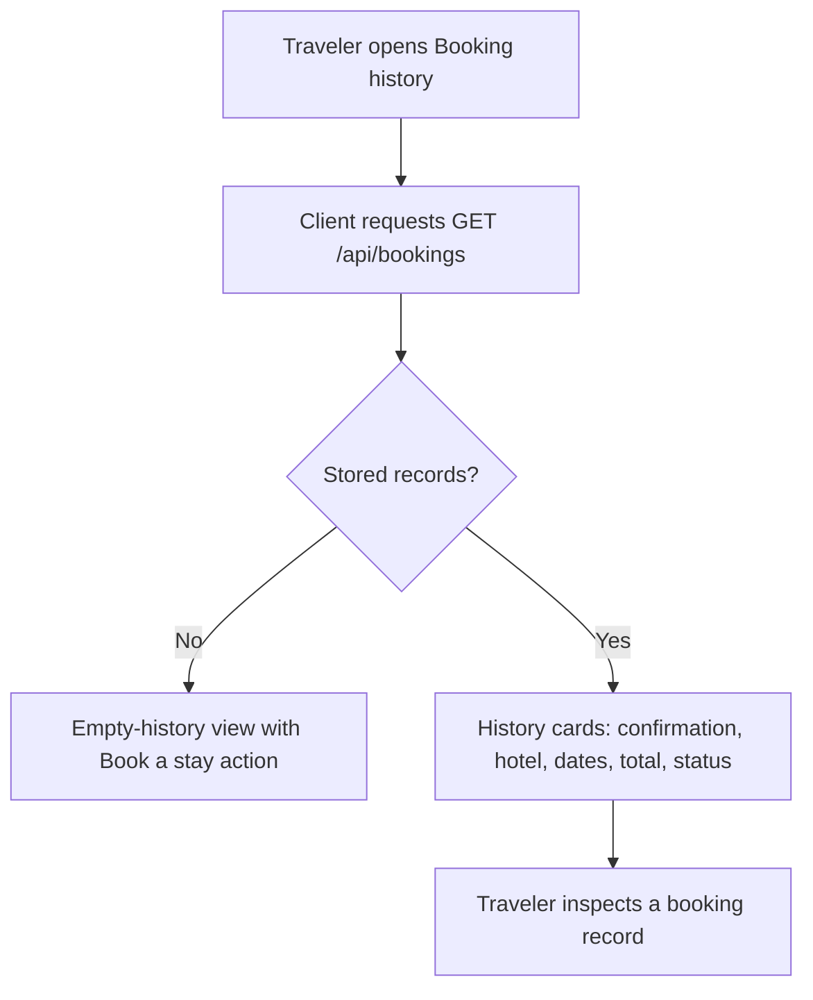

# Stayfinder application design

## Product boundary

Stayfinder is a local learning prototype for one traveler booking one room at one of a few synthetic hotels. A traveler searches a fixed destination, picks an available result, supplies contact details, and receives a simulated confirmation. The traveler can then review saved bookings.

Out of scope: payment, cancellation, authentication, multiple rooms, live availability, real travel inventory, external APIs, and emails.

## Four-layer decomposition

| Layer | Responsibility in this prototype | Evidence in the interface |
| --- | --- | --- |
| Interface | Search form, result cards, booking form, confirmation view, history view, empty/error/loading messages | Inputs, buttons, price cards, confirmation number, and saved-booking cards |
| Logic | Match a supported destination, require valid dates and traveler details, compute nights and total, create IDs, reject malformed booking requests | Validation message, computed total, and confirmation outcome |
| Data | Synthetic hotel catalog; selected hotel, destination, date range, traveler, price, booking ID, status, and timestamp | Hotel names, ratings, nightly prices, trip dates, guest name, and confirmation number |
| Persistence | Server reads/writes bookings to `server/data/bookings.json`; seed hotel catalog remains source-controlled | Booking stays available after refresh and normal server restart |

### Data model (planned)

```text
Property
  id, name, city, rating, reviewCount, nightlyRate, refundable, amenities, imageAlt

Booking
  id, confirmationCode, propertyId, propertyName, city,
  checkIn, checkOut, travelerName, travelerEmail,
  nights, nightlyRate, total, status, createdAt
```

All records are synthetic. `Booking` snapshots the display-critical property values so history remains understandable even if the seed catalog changes later.

## Frontend/backend contract (planned)

| HTTP request | Server responsibility | Client use |
| --- | --- | --- |
| `GET /api/properties?destination=...` | return the matching synthetic hotel list; reject/return an empty list for unsupported destinations | render loading, results, or no-results feedback |
| `POST /api/bookings` | validate request, find property, calculate nights/total, create confirmation, persist booking | show field/general error or confirmation screen |
| `GET /api/bookings` | read persisted booking records, newest first | render history or empty-history state |

The exact error status codes and request schemas will be documented when the API is implemented.

## Flow 1 — make a simulated booking



| Step | Interface | Logic | Data | Persistence |
| --- | --- | --- | --- | --- |
| Search | collects destination and dates | basic required-field check | query values | none |
| Results | renders selectable cards/no-results state | destination matching | property catalog | none |
| Booking | collects traveler info and summarizes selection | validates traveler/date/property; totals nights × rate | selected property and payload | none until valid submit |
| Confirmation | displays returned booking | creates ID and confirmation code | completed booking | append to JSON file |

### Flow 1 failure cases

- Missing destination, dates, traveler name, or email: form remains open and explains the missing/invalid value.
- Checkout on or before check-in: server rejects it; no booking is stored.
- Unknown property or unsupported destination: server rejects/returns no results; no booking is stored.

## Flow 2 — review booking history



| Step | Interface | Logic | Data | Persistence |
| --- | --- | --- | --- | --- |
| Open history | navigation and loading state | asks server for newest-first records | booking collection | reads JSON file |
| Empty result | clear next action | recognizes zero records | empty list | no change |
| Saved results | cards and booking details | ordering/formatting | booking snapshots | records survive refresh/restart |

## Storage lifetime

The planned server will own `server/data/bookings.json`. Browser refresh does not clear it because history is fetched from the server. A normal server restart also preserves records because the server reloads the same JSON file. Removing that file manually resets the prototype. This behavior is intentional and must be demonstrated in Part 2.

## Technology decision rationale

React/Vite keeps the visible flow organized into small reusable components without imposing a large framework. Express keeps the API and business rules explicit and inspectable. JSON over HTTP makes the client/server boundary visible in browser developer tools. A JSON file is sufficient for a single-user synthetic classroom prototype and makes persistence concrete; it is not appropriate for concurrent or production use.

## Planned implementation sequence

1. Scaffold the client and server, then make the server return synthetic properties.
2. Build the search/results/selection interface against the API.
3. Implement booking validation, JSON persistence, and confirmation.
4. Implement history and empty/error states.
5. Manually review, test in a browser, capture evidence, and merge the feature branch.

