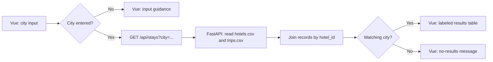

# Expedia Lite Part 1 design

## Responsibilities

| Layer | Responsibility |
| --- | --- |
| Vue interface | Collects the city query, requests search results, and renders input, loading, match, and no-match states. |
| FastAPI logic | Validates a nonblank city, reads the CSV records, joins trips to hotels through `hotel_id`, compares cities without regard to case, and calculates nights and stay price. |
| CSV data | `hotels.csv` supplies hotel identity, city, state, and nightly rate. `trips.csv` supplies fixed offered-stay dates and refers to its hotel by `hotel_id`. |
| Persistence | Part 1 reads the supplied CSVs only. Part 2 will seed SQLite once, then persist CRUD changes there. |

## Search flow

## Part 1 decisions

- A city search is exact after trimming whitespace and ignores capitalization. `Boston` and `boston` return the same four records.
- A blank city and a city with no matches are intentionally different: blank input receives guidance; `Miami` completes a valid search and displays a no-results message.
- `nights` is `check_out − check_in`; `stay_price_usd` is nights × the joined hotel nightly rate. Neither is stored in a second CSV column.
- The table keeps labels plain and explicit so the joined values can be inspected easily.

## Part 2 boundary

Part 2 will seed SQLite from all four supplied CSV files one time, then add frontend booking creation, history, cancellation (status update), and test-booking deletion through FastAPI. It must preserve changes across restarts without duplicating seed rows.

