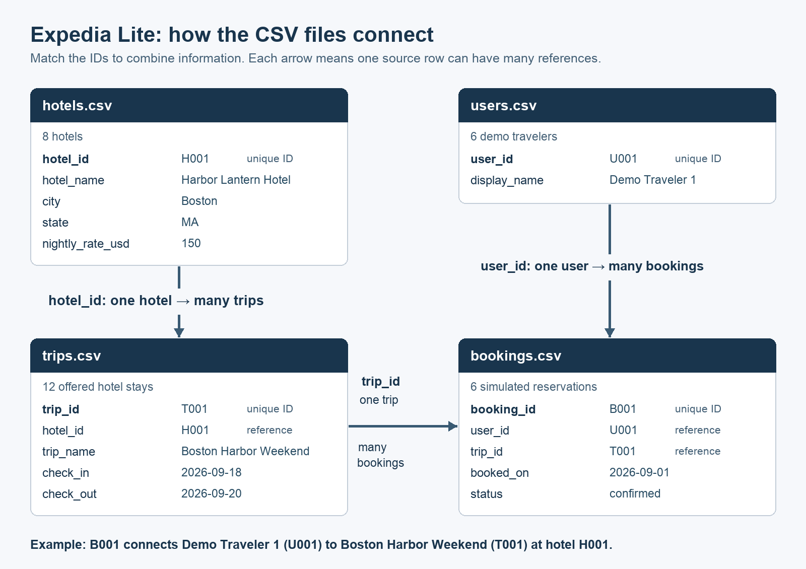

# Expedia Lite: Sample Data

These four CSV files contain fictional classroom data for a small travel application. All hotel names, travelers, bookings, and prices are invented. City names are real. The files do not describe live hotel availability or real reservations.

| File | One row represents | Rows | Unique ID |
| --- | --- | --- | --- |
| `hotels.csv` | One hotel | 8 | `hotel_id` |
| `users.csv` | One demo traveler | 6 | `user_id` |
| `trips.csv` | One offered hotel stay with fixed dates | 12 | `trip_id` |
| `bookings.csv` | One simulated reservation by a traveler for a trip | 6 | `booking_id` |

## Start with the CSV files

For Part 1, the Python backend reads the supplied CSV files. The Vue frontend sends a search request through the FastAPI routes, and displays matching trips in a plain table. Hotel and trip information are connected by `hotel_id`. The sample users and bookings support the later booking and history work.

In this simplified model, a **trip is a hotel stay**. Each trip names one hotel and a check-in/check-out date. Flights, room inventory, authentication, payments, taxes, and fees are outside the data model. Each trip has a fixed nightly price from its hotel. The same hotel may appear in several trips with different dates.

For Part 2, these CSVs become the initial records in SQLite. Changes made in the application should be stored in the database. Restarting the application should preserve those changes. Re-importing the starter files on every startup must not erase new bookings, restore deleted bookings, or duplicate the sample records.

## Open the files in Excel

1. Extract the ZIP, then open each `.csv` file in Excel. The first row contains column names. Widen or AutoFit the columns so the full names and dates are visible.
2. If all values appear in one column or characters look wrong, use Excel’s text/CSV import and select **UTF-8** encoding and a **comma** delimiter.
3. Treat IDs such as `H001` as text. Preserve their letters and leading zeros. Dates in the files use `YYYY-MM-DD`; Excel may display them differently without changing their meaning.
4. Explore a copy when sorting or editing. Keep the supplied filenames and column names available to the application. Do not replace a CSV with an `.xlsx` workbook by changing the extension.

The CSV files are UTF-8 with a byte-order mark to help Excel recognize the encoding. Python can read them with `encoding="utf-8-sig"` so the mark does not become part of the first column name. Rates use a decimal point, without a currency symbol or thousands separator. CSV stores text values; the application interprets dates and numbers as needed.

## How the IDs connect

- `trips.hotel_id` matches a `hotel_id` in `hotels.csv`.
- `bookings.user_id` matches a `user_id` in `users.csv`.
- `bookings.trip_id` matches a `trip_id` in `trips.csv`.

A file’s **unique ID** identifies one row in that file. An ID used to refer to another file is a **foreign key**. For example, `H001` appears once in `hotels.csv`, but several trips can refer to `H001`. Repeated references are expected.

Each booking has two references: a traveler ID and a trip ID. They connect the traveler to the selected trip. The booking still has its own `booking_id`, so the application can update or delete that specific reservation.

## Data dictionary

### `hotels.csv`

| Column | Meaning | Example |
| --- | --- | --- |
| `hotel_id` | Unique text ID for the hotel | `H001` |
| `hotel_name` | Fictional hotel name | Harbor Lantern Hotel |
| `city` | Searchable destination city | Boston |
| `state` | State or district abbreviation | MA |
| `nightly_rate_usd` | Price of one room for one night, in U.S. dollars | `150` |

### `users.csv`

| Column | Meaning | Example |
| --- | --- | --- |
| `user_id` | Unique text ID for the demo traveler | `U001` |
| `display_name` | Fictional label shown in the application | Demo Traveler 1 |

These are demonstration identities, not login accounts. No passwords or personal contact details are provided.

### `trips.csv`

| Column | Meaning | Example |
| --- | --- | --- |
| `trip_id` | Unique text ID for an offered stay | `T001` |
| `hotel_id` | Reference to the hotel for this trip | `H001` |
| `trip_name` | Short title for the offered stay | Boston Harbor Weekend |
| `check_in` | First day of the stay | `2026-09-18` |
| `check_out` | Departure day; no overnight stay on this date | `2026-09-20` |

The number of nights is the number of days from check-in to check-out. For `T001`, September 18–20 is **two nights**. Its estimated stay price is **2 × $150 = $300**. This amount is derived from the trip dates and hotel rate; it is not stored in a second CSV column.

### `bookings.csv`

| Column | Meaning | Example |
| --- | --- | --- |
| `booking_id` | Unique text ID for one reservation | `B001` |
| `user_id` | Reference to the traveler making the reservation | `U001` |
| `trip_id` | Reference to the selected offered stay | `T001` |
| `booked_on` | Date when this example reservation was made | `2026-09-01` |
| `status` | `confirmed` or `cancelled` | `confirmed` |

Changing a booking’s status to `cancelled` keeps the row for history. Deleting a booking removes the row. These are different operations. Any new booking needs a new `booking_id`; existing IDs should stay unchanged.

## Concrete records to check

The following examples use a city search that ignores capitalization. Ordering of the returned rows is not significant.

| City query | Expected trip IDs | Count |
| --- | --- | --- |
| `Boston` or `boston` | `T001`, `T002`, `T009`, `T010` | 4 |
| `New York` | `T003`, `T004`, `T011` | 3 |
| `Philadelphia` | `T005`, `T006` | 2 |
| `Washington` | `T007`, `T012` | 2 |
| `State College` | `T008` | 1 |
| `Miami` | No matching rows | 0 |

An empty search field and a city with no results are different situations. The interface should make its handling of both understandable.

For a Boston search, these are the joined values behind a possible plain results table:

| Trip ID | Hotel | Check-in | Check-out | Nights | Nightly rate | Stay price |
| --- | --- | --- | --- | --- | --- | --- |
| `T001` | Harbor Lantern Hotel | 2026-09-18 | 2026-09-20 | 2 | $150 | $300 |
| `T002` | Maple Square Inn | 2026-09-18 | 2026-09-21 | 3 | $120 | $360 |
| `T009` | Harbor Lantern Hotel | 2026-10-02 | 2026-10-04 | 2 | $150 | $300 |
| `T010` | Maple Square Inn | 2026-10-09 | 2026-10-12 | 3 | $120 | $360 |

One booking connects all four files:

**`B001` → `U001` + `T001` → `H001`**

`B001` belongs to **Demo Traveler 1** (`U001`), for **Boston Harbor Weekend** (`T001`), at **Harbor Lantern Hotel** (`H001`). It is confirmed, was booked on September 1, and covers September 18–20 at an estimated stay price of **$300**.

Before making any changes, Demo Traveler 1 has two history rows: `B001` (confirmed) and `B002` (cancelled). Demo Traveler 6 (`U006`) has **no bookings**, providing an example of an empty history. Across the starter data, there are four confirmed and two cancelled bookings.

## Thursday: check SQLite before installing anything

Follow **CHECK → TAKE ACTION → VERIFY** in the project’s Python environment.

- **CHECK:** Ask the agent to identify the project’s Python interpreter and check whether it can import `sqlite3`. It should report the interpreter and SQLite version.
- **TAKE ACTION:** If the import succeeds, skip installation. If it fails, ask the agent to explain the missing capability and propose the smallest environment-specific correction for approval. Do not assume that `pip install sqlite3` is the required step.
- **VERIFY:** Use the selected interpreter to create a small local SQLite file, save a sample row, close the connection, reopen the same file, and read the row back.

Python documents `sqlite3` as an optional standard-library module, and SQLite does not require a separate database server. The check determines whether the selected Python distribution already provides it. See the [Python sqlite3 documentation](https://docs.python.org/3/library/sqlite3.html).

## Files in this pack

The pack contains the four CSVs, this guide, `relationships.png`, and its editable `relationships.svg` source. The diagram’s text alternative is the “How the IDs connect” section above. The instructor’s generator validates unique IDs, linked IDs, dates, and sample search results before packaging.
